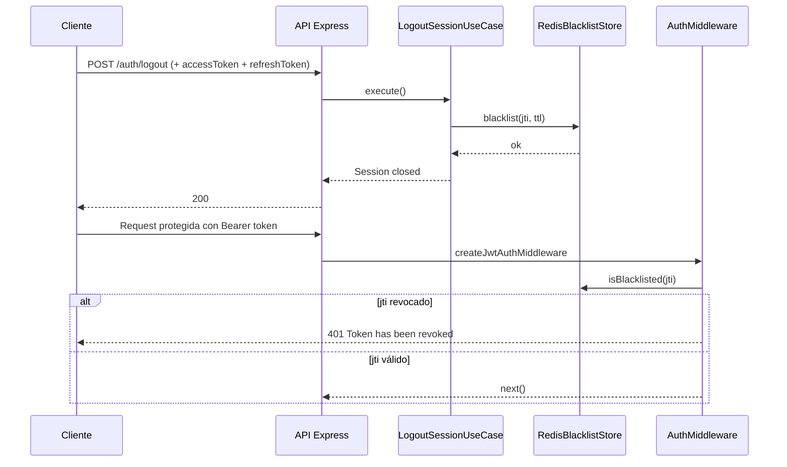

# Uso de Redis en el proyecto

## Resumen ejecutivo

Redis se utiliza en este backend para **revocación temprana de access tokens**. Esto permite invalidar un token antes de su expiración natural (por ejemplo, en logout), manteniendo verificaciones rápidas en cada request protegida.

La persistencia principal de negocio permanece en PostgreSQL (tabla y esquema inicial en [database/init.sql](../database/init.sql)). Redis se aplica a estado efímero de seguridad con vencimiento (TTL).

---

## ¿Por qué usa Redis?

El backend necesita invalidar access tokens antes de que expiren por tiempo.

- En JWT stateless, el token suele seguir siendo válido hasta su `exp`.
- Para cortar su validez anticipadamente, se mantiene una blacklist por `jti`.
- Ese estado es temporal y con expiración, ideal para Redis.

### Razones técnicas

1. **TTL nativo**: cada token revocado puede expirar automáticamente cuando ya no corresponde bloquearlo.
2. **Baja latencia**: lookup rápido en requests autenticadas.
3. **Simplicidad operativa**: patrón clave-valor para blacklist.
4. **Escalabilidad horizontal**: múltiples instancias del backend comparten la misma blacklist (si apuntan al mismo Redis).

---

## ¿En qué casos lo usa?

### 1) Logout (revocación)

Al cerrar sesión:

- se toma el `accessToken`
- se decodifica su `jti` y `exp`
- se calcula TTL restante
- se guarda `jti` en blacklist

Referencias:

- [src/application/auth/logout-session.use-case.js](../src/application/auth/logout-session.use-case.js#L21)
- [src/application/auth/logout-session.use-case.js](../src/application/auth/logout-session.use-case.js#L33)

### 2) Requests protegidos

En cada request autenticada con JWT:

- se verifica firma/issuer/audience
- se valida `tokenType=access`
- se consulta si el `jti` está blacklisteado
- si está revocado, responde `401`

Referencia:

- [src/presentation/http/middlewares/auth.middleware.js](../src/presentation/http/middlewares/auth.middleware.js#L46)

---

## ¿Cuándo lee y cuándo escribe Redis?

- **Escritura en Redis**: durante logout/revocación de sesión.
- **Lectura en Redis**: en cada request autenticada que pasa por `createJwtAuthMiddleware()`.

Referencia de middleware:

- [src/presentation/http/middlewares/auth.middleware.js](../src/presentation/http/middlewares/auth.middleware.js#L18)

---

## ¿Dónde está implementado? (componentes y archivos)

1. Implementación Redis de blacklist:
   - [src/infrastructure/cache/redis/access-token-blacklist.store.js](../src/infrastructure/cache/redis/access-token-blacklist.store.js#L7)
2. Selección de store (Redis vs memoria) en DI container:
   - [src/shared/container.js](../src/shared/container.js#L60)
3. Configuración de variables Redis:
   - [src/shared/config/env.js](../src/shared/config/env.js#L61)
4. Servicio Redis en contenedores:
   - [docker-compose.yml](../docker-compose.yml#L39)

---

## ¿Cómo funciona internamente?

## 1. Creación del store desde DI

El contenedor crea `RedisAccessTokenBlacklistStore` si hay URL de Redis disponible.

Referencia:

- [src/shared/container.js](../src/shared/container.js#L61)

## 2. Conexión del cliente Redis

El store usa `createClient()` y establece conexión al iniciar.

Referencias:

- [src/infrastructure/cache/redis/access-token-blacklist.store.js](../src/infrastructure/cache/redis/access-token-blacklist.store.js#L1)
- [src/infrastructure/cache/redis/access-token-blacklist.store.js](../src/infrastructure/cache/redis/access-token-blacklist.store.js#L19)

## 3. Escritura de blacklist con expiración

En logout se guarda clave con patrón:

- `blacklist:access:<jti>`

Y expiración `EX` en segundos (TTL).

Referencia:

- [src/infrastructure/cache/redis/access-token-blacklist.store.js](../src/infrastructure/cache/redis/access-token-blacklist.store.js#L28)

## 4. Verificación en middleware

Antes de aceptar el token, el middleware consulta `isBlacklisted()`.

Referencia:

- [src/infrastructure/cache/redis/access-token-blacklist.store.js](../src/infrastructure/cache/redis/access-token-blacklist.store.js#L39)

---

## Flujo simplificado

---

## Nota importante actual

Actualmente, la idempotencia todavía se maneja en memoria local:

- [src/shared/container.js](../src/shared/container.js#L59)

Usa `InMemoryIdempotencyKeyStore`, no Redis. Esto implica que la idempotencia no es distribuida entre múltiples instancias.

### Conclusión operativa

A día de hoy Redis está aplicado al flujo de revocación de access tokens. El siguiente paso natural de arquitectura es mover idempotencia a Redis para consistencia distribuida en despliegues con más de una instancia del backend.
