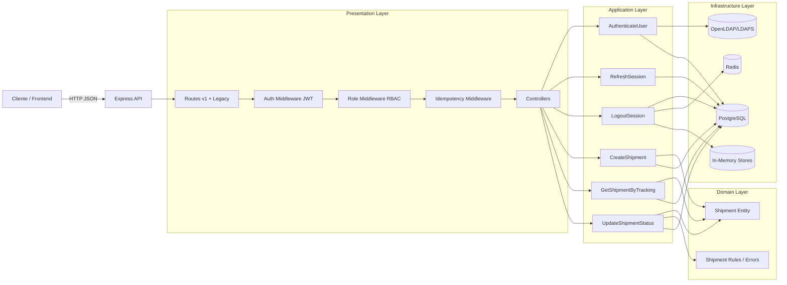

# 1. 📌 Título y Visión General

# Red de Deliveries Backend (OpenLDAP)


Backend de gestión de envíos con autenticación corporativa LDAP/LDAPS, autorización por roles y trazabilidad auditable de cambios de estado.

El sistema expone APIs versionadas (v1 y legacy), soporta sesiones con JWT (access + refresh con rotación/revocación), idempotencia para mutaciones y persistencia en PostgreSQL.

---

## Tabla de contenidos

- [1. 📌 Título y Visión General](#1--título-y-visión-general)
- [2. 🏗️ Arquitectura e Interconexión de Procesos](#2-️-arquitectura-e-interconexión-de-procesos)
- [3. 🛠️ Requisitos Previos (Prerequisites)](#3-️-requisitos-previos-prerequisites)
- [4. 🚀 Construcción y Configuración (Build & Setup)](#4--construcción-y-configuración-build--setup)
- [5. 💻 Ejecución del Proyecto (Run)](#5--ejecución-del-proyecto-run)
- [6. 🧪 Pruebas (Testing)](#6--pruebas-testing)
- [7. 📂 Estructura del Proyecto](#7--estructura-del-proyecto)
- [8. 📝 Buenas Prácticas y Guía de Contribución](#8--buenas-prácticas-y-guía-de-contribución)

---

# 2. 🏗️ Arquitectura e Interconexión de Procesos

## 2.1 Patrón arquitectónico

El proyecto implementa un enfoque de **arquitectura por capas con principios de Clean Architecture/Hexagonal**:

- **Presentation**: controladores HTTP, rutas y middlewares.
- **Application**: casos de uso que orquestan reglas de negocio.
- **Domain**: entidades, invariantes y errores de dominio.
- **Infrastructure**: adaptadores técnicos (PostgreSQL, LDAP, Redis/in-memory).
- **Shared**: composición de dependencias, seguridad JWT y configuración.

La dirección de dependencias apunta hacia el dominio. Los detalles técnicos quedan en adaptadores reemplazables.

## 2.2 Componentes principales

1. **Cliente HTTP** (frontend o consumidor API)
2. **API Express**
3. **Middlewares de seguridad**
   - `auth`: verifica JWT access token.
   - `role`: aplica autorización RBAC.
   - `idempotency`: evita reprocesamiento en operaciones mutables.
4. **Controllers**
   - `AuthController`
   - `ShipmentController`
   - `JwksController`
5. **Use Cases**
   - `AuthenticateUserUseCase`
   - `RefreshSessionUseCase`
   - `LogoutSessionUseCase`
   - `CreateShipmentUseCase`
   - `GetShipmentByTrackingUseCase`
   - `UpdateShipmentStatusUseCase`
6. **Infraestructura**
   - PostgreSQL (`envios`, `audit_logs`, `auth_refresh_tokens`)
   - LDAP (autenticación de identidad)
   - Redis o in-memory (blacklist e idempotencia)
7. **Container de DI**
   - Ensambla dependencias y reduce acoplamiento entre capas.

## 2.3 Flujo de datos end-to-end

### A) Login y emisión de tokens

1. Cliente envía credenciales a `POST /api/v1/auth/login`.
2. `AuthController` delega en `AuthenticateUserUseCase`.
3. Caso de uso consulta `LdapAuthRepository` (bind/search en LDAPS).
4. Si credenciales son válidas:
   - se emite `access token` (JWT)
   - se emite `refresh token` (JWT)
   - se persiste hash SHA-256 del refresh token en PostgreSQL.
5. Se responde con tokens y contexto mínimo de usuario.

### B) Mutación de envío (crear o actualizar estado)

1. Cliente llama endpoint mutable (`POST /shipments`, `PATCH /shipments/:codigo/status` o rutas legacy equivalentes).
2. Middleware `auth` valida firma/issuer/audience y exige `tokenType=access`.
3. Middleware `role` verifica permisos por perfil (`MOSTRADOR`, `DESPACHO`, `ADMIN`).
4. Middleware `idempotency` valida `Idempotency-Key` y bloquea duplicados.
5. Controller invoca caso de uso.
6. Caso de uso interactúa con repositorio PostgreSQL.
7. En actualización de estado, se ejecuta transacción:
   - lectura de envío
   - validación de transición en entidad `Shipment`
   - actualización de estado
   - registro de auditoría en `audit_logs`
8. Respuesta HTTP estructurada con resultado de negocio.

### C) Refresh y logout

- **Refresh**:
  1. valida `refreshToken`
  2. verifica firma y expiración
  3. confirma token activo en DB
  4. revoca token actual
  5. emite nuevo par de tokens (rotación)
  6. persiste nuevo refresh token hash

- **Logout**:
  1. revoca refresh token en DB
  2. decodifica access token
  3. guarda `jti` en blacklist (Redis o memoria) con TTL remanente

## 2.4 Interconexión Frontend → Backend → DB

- **Frontend**: actualmente estático (HTML en carpeta pública) o clientes externos.
- **Backend**: API REST Express con rutas v1 y legacy.
- **DB**: PostgreSQL como fuente de verdad para envíos, auditoría y sesiones.
- **Cache/estado efímero**: Redis (si está disponible) para blacklist distribuida; fallback in-memory para entorno local.

## 2.5 Diagrama Mermaid



---

# 3. 🛠️ Requisitos Previos (Prerequisites)

- **Node.js**: 20+
- **npm**: 10+
- **Docker**: 24+
- **Docker Compose**: 2.20+
- **PostgreSQL**: 17 (si ejecutas sin Docker)
- **Redis**: 7 (opcional fuera de Docker; recomendado para blacklist distribuida)
- **OpenLDAP/LDAPS**: requerido para login real contra directorio corporativo
- **Git**: 2.40+

Sistema operativo soportado: Windows, Linux o macOS.

---

# 4. 🚀 Construcción y Configuración (Build & Setup)

## 4.1 Clonar repositorio

```bash
git clone https://github.com/DonMiguels/Proyecto2-Seguridad.git
cd Proyecto2-Seguridad
```

## 4.2 Instalar dependencias

```bash
npm install
```

## 4.3 Variables de entorno

Crear archivo `.env` en la raíz del proyecto.

### Ejemplo `.env.example`

```env
# App
NODE_ENV=development
PORT=3000
LOG_GMT_OFFSET=-4

# PostgreSQL
DB_HOST=localhost
DB_PORT=5432
DB_NAME=deliveries
DB_USER=postgres
DB_PASSWORD=change_me

# Redis (opcional para blacklist distribuida)
REDIS_URL=redis://localhost:6379
ACCESS_TOKEN_BLACKLIST_TTL_SECONDS=3600

# JWT
JWT_ALGORITHM=HS256
JWT_SECRET=change_me_super_secret
JWT_ISSUER=deliveries-api
JWT_AUDIENCE=deliveries-clients
JWT_EXPIRES_IN=1h
JWT_REFRESH_EXPIRES_IN=7d

# JWT RS256 (opcional; requerido si JWT_ALGORITHM=RS256)
JWT_PRIVATE_KEY=
JWT_PUBLIC_KEY=

# LDAP / OpenLDAP
LDAP_URL=ldaps://localhost:636
LDAP_BASE_DN=dc=example,dc=org
LDAP_USER_ATTRIBUTE=uid
LDAP_BIND_DN=
LDAP_BIND_PASSWORD=
LDAP_ROLE_MAPPING={}
```

## 4.4 Build para producción

### Build de imagen Docker multistage (production target)

```bash
docker compose --profile prod build backend
```

### Levantar stack productivo

```bash
docker compose --profile prod up -d
```

### Alternativa por script npm

```bash
npm run build
npm start
```

---

# 5. 💻 Ejecución del Proyecto (Run)

## 5.1 Backend en desarrollo (sin Docker)

```bash
npm run debugging
```

## 5.2 Frontend en desarrollo

Este proyecto no implementa un frontend SPA desacoplado. El contenido estático se sirve desde Express.

- Levanta el backend y accede al recurso estático principal.

## 5.3 Ejecución con contenedores

### Modo desarrollo (hot reload por volumen)

```bash
npm run dev
```

### Modo producción

```bash
npm start
```

### Apagar y limpiar volúmenes

```bash
npm run clean
```

## 5.4 URLs locales por defecto

- API base: http://localhost:3000/api
- API v1: http://localhost:3000/api/v1
- JWKS: http://localhost:3000/api/v1/.well-known/jwks.json
- Front estático (si aplica): http://localhost:3000

---

# 6. 🧪 Pruebas (Testing)

## 6.1 Estrategia de pruebas (profunda)

La estrategia actual se basa en dos niveles principales, con foco en confiabilidad de dominio y contratos HTTP:

1. **Unitarias (rápidas, aisladas)**
   - Validan reglas de negocio puras y comportamiento de casos de uso.
   - Cobertura crítica: transiciones de estado, errores de dominio, validaciones de payload, seguridad JWT y refresh.

2. **Integración (componentes conectados)**
   - Verifican repositorios PostgreSQL con `pg-mem` y controladores HTTP con `supertest`.
   - Objetivo: asegurar que contrato API + persistencia funcionen de extremo a extremo dentro del backend.

No hay suite E2E navegador/cliente final formalizada aún.

### Pirámide aplicada

- Base amplia en unit tests.
- Capa media de integración para puntos críticos (auth, repos, controladores).
- Capa E2E pendiente de institucionalizar.

## 6.2 Comandos de ejecución

### Pruebas Unitarias

```bash
npm run test:unit
```

### Pruebas de Integración

```bash
npm run test:integration
```

### Suite completa

```bash
npm test
```

### Pruebas End-to-End (E2E)

Estado actual: **no existe script E2E dedicado** en `package.json`.

Recomendación de estandarización:

```bash
# ejemplo sugerido una vez incorporado Playwright/Cypress
npm run test:e2e
```

## 6.3 Cobertura de código (Coverage)

El archivo de configuración de Vitest tiene cobertura deshabilitada por defecto.

### Ejecución puntual de coverage

```bash
npx vitest run --coverage.enabled true
```

Si el entorno solicita proveedor de coverage, instalar:

```bash
npm i -D @vitest/coverage-v8
```

Luego ejecutar:

```bash
npx vitest run --coverage
```

## 6.4 Cómo leer el reporte

- **Statements/Branches/Functions/Lines**: priorizar ramas en módulos de seguridad (`auth`, `refresh`, middlewares).
- Subir cobertura en:
  - paths de error LDAP
  - revocación/rotación de tokens
  - respuestas idempotentes duplicadas
  - escenarios de autorización por rol

## 6.5 Riesgos de calidad y controles

- **Riesgo**: regresiones en transiciones de estado.
  - **Control**: unit tests de entidad + caso de uso de actualización.
- **Riesgo**: vulnerabilidades de sesión.
  - **Control**: tests de middleware JWT + refresh/logout.
- **Riesgo**: ruptura de contrato HTTP.
  - **Control**: integración de controladores con `supertest`.

---

# 7. 📂 Estructura del Proyecto

```text
.
├─ database/                 # SQL de inicialización (tablas, índices, seed demo)
├─ docs/                     # Documentación por fases y arquitectura
├─ public/                   # Activos estáticos servidos por Express
├─ src/
│  ├─ application/           # Casos de uso
│  │  ├─ auth/               # Login, refresh, logout
│  │  └─ shipment/           # Crear, consultar y actualizar envíos
│  ├─ config/                # Configuración de DB
│  ├─ controllers/           # Controladores legacy
│  ├─ domain/                # Entidades, enums y errores de dominio
│  ├─ infrastructure/        # Adaptadores técnicos (DB, LDAP, cache)
│  ├─ presentation/          # HTTP routes/controllers/middlewares
│  ├─ queries/               # Queries legacy
│  ├─ routes/                # Rutas legacy
│  ├─ shared/                # DI container, config, seguridad JWT/JWKS
│  └─ utils/                 # Logger y utilidades
├─ tests/
│  ├─ unit/                  # Tests unitarios
│  └─ integration/           # Tests de integración
├─ docker-compose.yml        # Orquestación local/dev/prod
├─ Dockerfile                # Build multistage (dev/prod)
├─ package.json              # Scripts y dependencias
├─ server.js                 # Bootstrap del servidor
└─ vitest.config.js          # Configuración de pruebas
```

---

# 8. 📝 Buenas Prácticas y Guía de Contribución

## 8.1 Commits

Usar **Conventional Commits**:

- `feat:` nueva funcionalidad
- `fix:` corrección de bug
- `refactor:` mejora interna sin cambio funcional
- `test:` nuevas pruebas o ajuste de tests
- `docs:` cambios de documentación
- `chore:` tareas de mantenimiento

Ejemplo:

```bash
git commit -m "feat(auth): add refresh token rotation"
```

## 8.2 Estilo de código

- Lint: ESLint
- Formato: Prettier
- Ejecutar antes de push:

```bash
npm run lint
npm run format:check
npm test
```

## 8.3 Flujo de ramas

Recomendación operativa:

- `main`: rama estable/protección de despliegue.
- `feature/<nombre>`: nuevas funcionalidades.
- `fix/<nombre>`: correcciones.
- PR obligatorio con revisión.

Modelo sugerido: **Trunk-Based Development con ramas cortas**.

## 8.4 Checklist para Pull Request

1. Rama actualizada con `main`.
2. Tests unitarios e integración en verde.
3. Lint y formato sin errores.
4. Descripción de alcance, riesgo y rollback.
5. Evidencia de prueba (logs/capturas/salida de tests).
6. Si cambia contrato API, documentar request/response y códigos HTTP.

## 8.5 Criterios mínimos de aceptación para merge

- No romper endpoints existentes v1/legacy.
- Mantener compatibilidad de esquema DB o incluir migración.
- Preservar seguridad: JWT válido, roles, idempotencia en mutaciones.
- Cobertura no decreciente en módulos críticos.

---

## Nota final

Esta documentación está alineada con el estado actual del repositorio y preparada para evolucionar hacia una suite E2E completa, observabilidad y endurecimiento de sesión distribuida con Redis.
