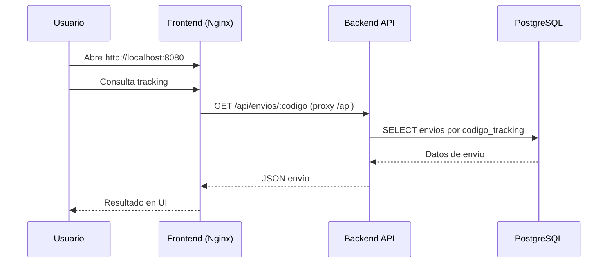
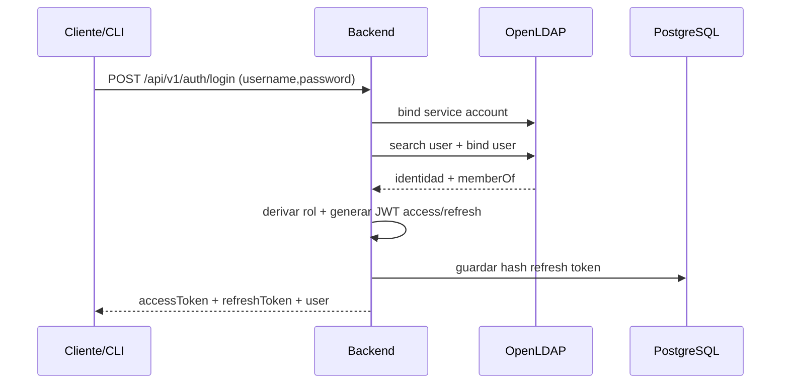
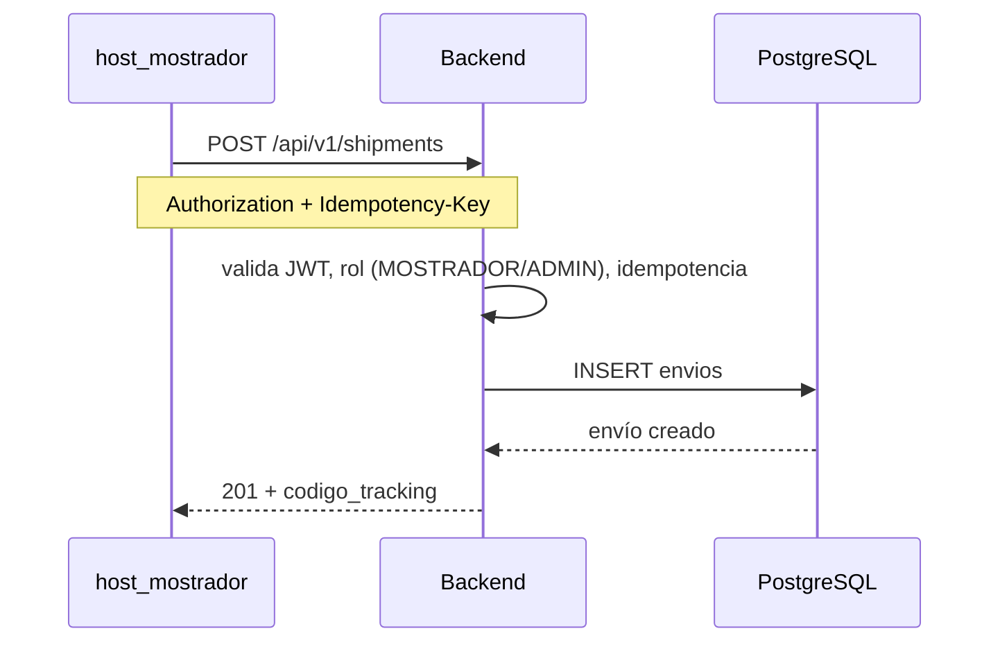
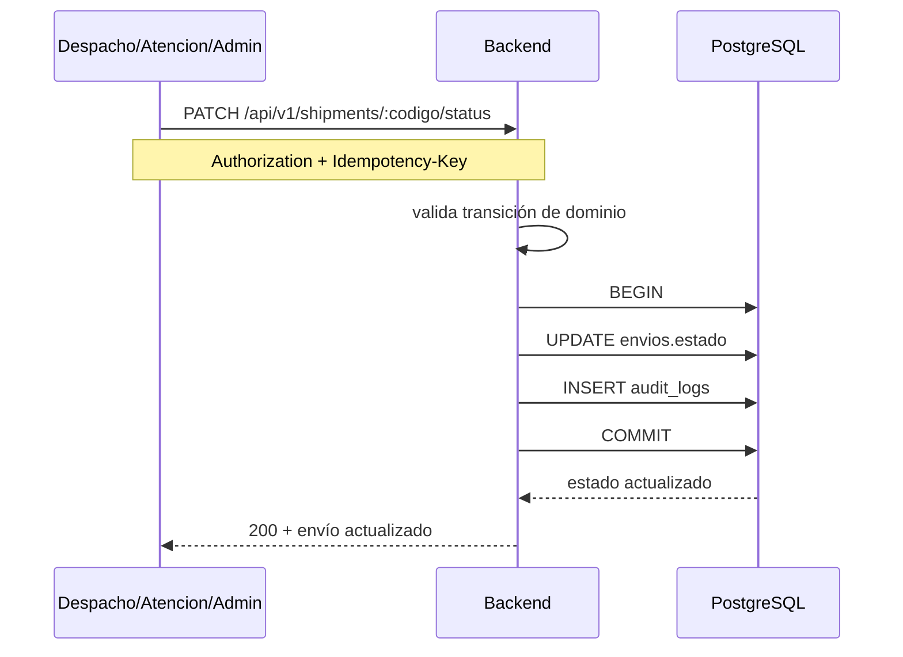
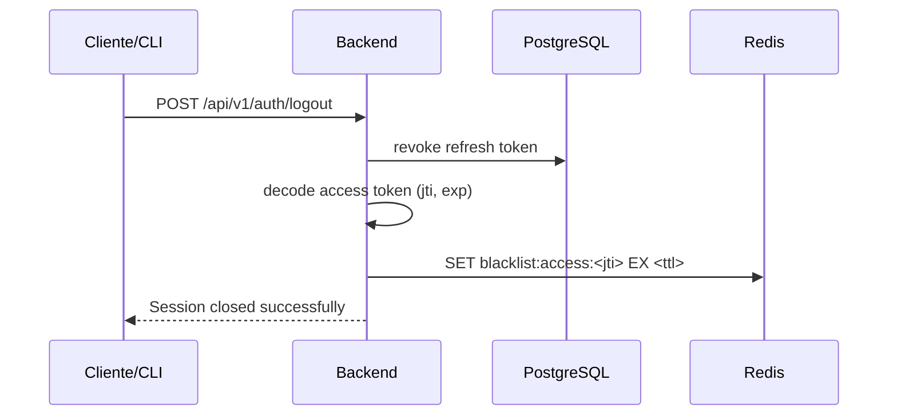

# Flujo de Datos End-to-End

## 1. Visión general

La plataforma opera con un patrón de entrada controlada por frontend y API central, con integración a identidad y datos internos.

Componentes del flujo:

- Frontend público (Nginx + página de tracking)
- Backend API (Express)
- PostgreSQL (envíos, auditoría, refresh tokens)
- Redis (blacklist de access tokens por `jti`)
- OpenLDAP (autenticación y rol)
- Hosts CLI (operación interna por departamentos)

Segmentación obligatoria:

- Tráfico público: `edge_net`
- Tráfico interno de aplicación: `app_net` (`internal`)
- Identidad: `identity_net` (`internal`)
- Datos: `data_net` (`internal`)

---

## 2. Flujo: consulta de tracking desde frontend público

Notas:

- Frontend no accede directo a DB.
- Nginx enruta `/api/*` hacia `backend:3000/api/*` en red interna `app_net`.

---

## 3. Flujo: login LDAP + emisión de tokens

Notas:

- El rol final proviene del mapeo grupo LDAP ↔ rol de negocio.
- El refresh token se persiste hasheado (`sha256`) en `auth_refresh_tokens`.
- Validación TLS LDAP estricta en backend (`LDAP_TLS_REJECT_UNAUTHORIZED=true` + CA confiable).

---

## 4. Flujo: creación de envío desde Host Mostrador

Reglas relevantes:

- `Idempotency-Key` obligatorio para mutaciones.
- La API aplica autorización por rol en rutas mutables.

---

## 5. Flujo: actualización de estado con auditoría transaccional

Notas:

- El caso de uso asegura consistencia entre cambio de estado y registro en `audit_logs`.
- Si falla una parte, la transacción revierte.

---

## 6. Flujo: logout y revocación temprana de access token

En requests protegidos posteriores:

1. Middleware valida firma JWT.
2. Consulta Redis para `jti`.
3. Si está en blacklist, responde `401 Token has been revoked`.

---

## 7. Persistencia y tablas principales

- `envios`: entidad principal de negocio.
- `audit_logs`: trazabilidad de acciones críticas.
- `auth_refresh_tokens`: sesión y rotación de refresh tokens (hash + revocación + expiración).

Datos demo iniciales se cargan mediante `database/init.sql`.

---

## 8. Legacy vs v1

La API mantiene compatibilidad:

- v1: `/api/v1/*`
- legacy: `/api/*` (por ejemplo `/api/envios/:codigo`)

El frontend público utiliza endpoints legacy para tracking y estado, mientras que hosts CLI operan contra v1.

## 9. Seguridad de despliegue

- Solo frontend publica puertos al host.
- Backend, LDAP, DB, Redis y hosts CLI permanecen sin `ports` expuestos.
- Secretos de runtime se consumen desde archivos de secretos Docker.
